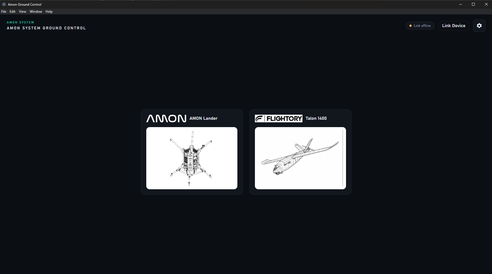
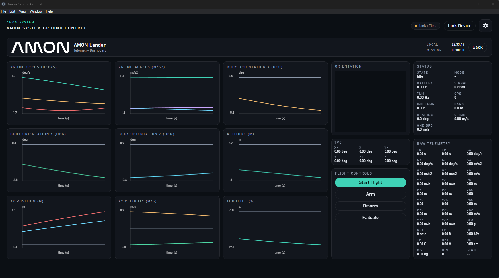

# Amon Ground Control

**Short description:** Desktop ground control station for the Amon Lander. The app uses an Electron UI with a Python backend to stream telemetry, render a 3D model, and plot live data.





---

## Table of Contents

- [Overview](#overview)
- [Features](#features)
- [Quick Start](#quick-start)
- [Development Notes](#development-notes)
- [Repository Structure](#repository-structure)
- [Status and Disclaimer](#status-and-disclaimer)
- [License](#license)

---

## Overview

**Amon Ground Control** is the operator desktop app for selecting a vehicle, connecting to the link, and monitoring live telemetry. It renders a 3D orientation model, a telemetry status panel, and multiple live charts for IMU, position, velocity, and throttle.

Part of the Amon Lander project:

>- **Amon Lander** - overall vehicle, frame, test/control software, and data
>  https://github.com/TilenTinta/Amon_Lander
>- **Amon Board** - flight controller hardware and firmware
>  https://github.com/TilenTinta/Amon_Board
>- **Amon Link** - desktop RF bridge for the ground control system
>  https://github.com/TilenTinta/Amon_Link

---

## Features

- Electron desktop UI with telemetry dashboard
- Python FastAPI backend for link and telemetry endpoints
- 3D orientation model rendering (Three.js)
- Multi-series telemetry plots for IMU, orientation, altitude, position, velocity, and throttle
- Link management, status, and telemetry panels

---

## Quick Start

1. Install Python dependencies:

```bash
pip install -r AmonControl/requirements.txt
```

2. Install Node dependencies:

```bash
cd AmonControl
npm install
```

3. Run the app:

```bash
npm start
```

The Electron app starts the Python backend automatically (unless `START_BACKEND=0` is set).

---

## Development Notes

- The Python backend entry point is `AmonControl/backend_server.py`.
- The Electron main process is `AmonControl/electron/main.js`.
- You can set `PYTHON` to point to a specific Python executable.
- Set `START_BACKEND=0` if you want to run the backend manually.

---

## Repository Structure

- `AmonControl/` - Electron app and Python backend
- `Images/` - UI assets and logos
- `Models/` - 3D model assets
- `Pictures/` - README screenshots

---

## Status and Disclaimer

This project is under active development. Expect incomplete features and changing interfaces.

---
